<!-- badges: start -->

[](https://CRAN.R-project.org/package=zuericssstyle) [](https://github.com/StatistikStadtZuerich/zuericssstyle/actions/workflows/R-CMD-check.yaml) [](https://cmp-sdlc.stzh.ch/OE-7035/ssz-da/libraries/zueriverse/zuericssstyle/badges/main/pipeline.svg?key_text=GitLabPipeline&key_width=100)

<!-- badges: end -->

# zuericssstyle 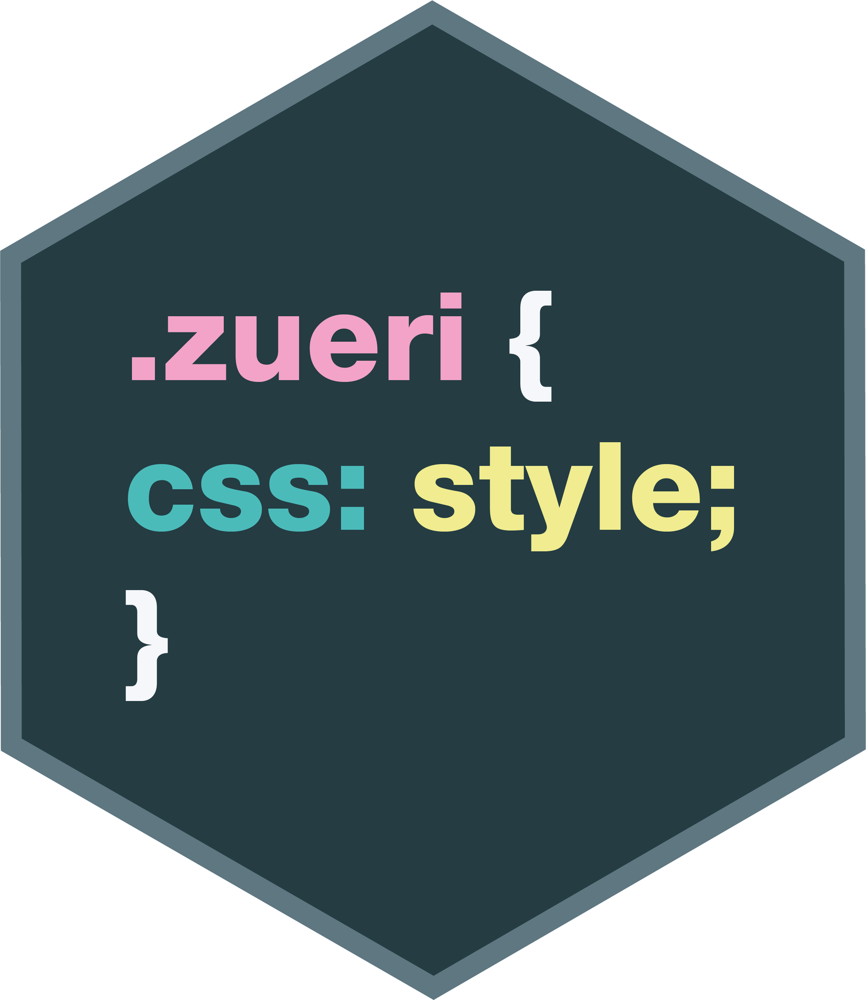

`zuericssstyle` is an R package that provides CSS styles and styled [Shiny](https://shiny.posit.co/) components aligned with the [corporate design](https://designsystem.stadt-zuerich.ch/current/?path=/story/docs-about--page) of the City of Zurich. The package includes reusable styling utilities and widgets that enable the development of Shiny applications consistent with the visual identity guidelines of the City of Zurich.

The components included in this package are based on styling and widgets previously developed and used by [Statistik Stadt Zürich](https://www.stadt-zuerich.ch/de/politik-und-verwaltung/stadtverwaltung/prd/ssz.html) for building Shiny applications.

## Installation

You can install the latest version of `zuericssstyle` directly from this repository:

``` r
# install.packages("devtools")
devtools::install_github("StatistikStadtZuerich/zuericssstyle")
```

Alternatively, you can download the repository as a ZIP archive. After extracting the files to a local directory (e.g. your Desktop), install the package using:

``` r
remotes::install_local("<path_to_location>/zuericssstyle-main")
```

## Version

To check the currently installed version of `zuericssstyle`, run:

``` r
packageVersion("zuericssstyle")
```

## Usage

`zuericssstyle` provides a set of wrapper functions around widgets from Shiny to apply styling consistent with the corporate design of the City of Zurich. These wrapper functions extend the original widgets while allowing additional arguments to be passed through the underlying Shiny functions.

### Styled Shiny Widgets

All widgets styled by `zuericssstyle` require the package's CSS to be loaded. The CSS is automatically included in the HTML dependency when using either `ssz_page()` or `add_zcss_deps()`.

The recommended approach is to use `ssz_page()` as a styled drop-in replacement for `fluidPage()` from Shiny:

``` r
# preferred: styled page wrapper
ui <- ssz_page(...)
```

If your application uses a different page layout (e.g. `fixedPage()`), you can instead wrap the UI definition with `add_zcss_deps()` to include the required CSS dependencies:

``` r
# alternative: include styling and icons around your UI
ui <- add_zcss_deps(fixedPage(...))
```

This ensures that all `zuericssstyle` widgets are rendered with the correct styling work without additional setup. All additional arguments supported by the underlying Shiny functions can be passed to the corresponding `ssz*` functions.

#### Numeric Input

`sszNumericInput()` provides a styled numeric input field based on `numericInput()` from Shiny.

``` r
sszNumericInput("number", "Zahl", 4)
```


#### Select Input

`sszSelectInput()` provides a styled version of `selectInput()` from Shiny.

``` r
sszSelectInput(
    "select",
    "Destination",
    choices = c("HOU", "LAX", "JFK", "SEA"),
    selected = "LAX"
  )

sszSelectInput(
    "selectmultiple",
    "Destination (Multiple)",
    choices = c("HOU", "LAX", "JFK", "SEA"),
    multiple = TRUE
  )
```

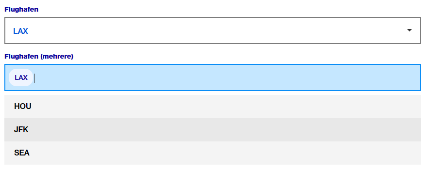

#### Radio Buttons

`sszRadioButtons()` provides a styled version of `radioButtons()` from Shiny.

``` r
sszRadioButtons(
   inputId = "ButtonGroupLabel",
   label = "Flughafen:",
   choices = c("EWR", "JFK", "LGA"),
   selected = "JFK"
   )

sszRadioButtons(
    inputId = "ButtonGroupLabelHorizontal",
    label = "Flughafen",
    choices = c("HOU", "LAX", "JFK"),
    selected = "JFK",
    inline = TRUE
  )
```

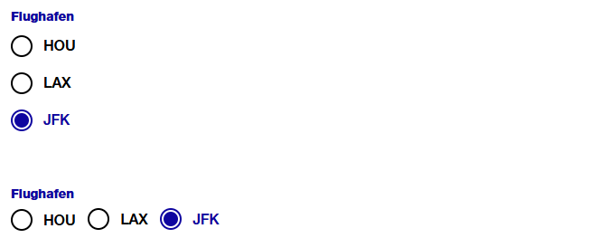

#### Radio Group Buttons

`sszRadioGroupButtons()` provides a styled version of `radioGroupButtons()` from [`shinyWidgets`](https://dreamrs.github.io/shinyWidgets/).

``` r
sszRadioGroupButtons(
    inputId = "years",
    choices = 2022:2024,
    selected = 2022 # default value
  )
```

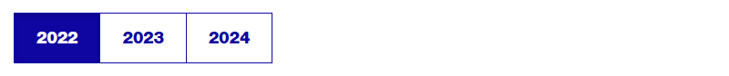

#### Text Input

`sszTextInput()` provides a styled version of `textInput()` from Shiny.

``` r
sszTextInput("suchfeld", "Name:")
```


#### Autocomplete

`sszAutocompleteInput()` provides an autocomplete-enabled text input based on `autocomplete_input()` from the [`dqshiny`](https://github.com/daqana/dqshiny) package.

``` r
sszAutocompleteInput(
            "name",
            "Geben Sie einen Namen ein",
            options = c("aoqiheu", "acdzvxp", "aqneluk", "aeloxch")
          )
```

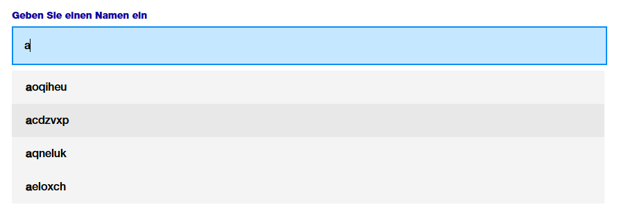

#### Slider Input

`sszSliderInput()` provides a styled version of `sliderInput()` from Shiny. *Note*: As of 2024-10-16, the slider styling is not officially part of the corporate design guidelines. Therefore, the appearance of this widget may change in future versions of this package.

``` r
sszSliderInput("choose_numbers",
    "Input",
    value = c(30, 60),
    min = 0,
    max = 100
  )

sszSliderInput("choose_number",
    "Single Input",
    value = c(30),
    min = 0,
    max = 100
  )
```

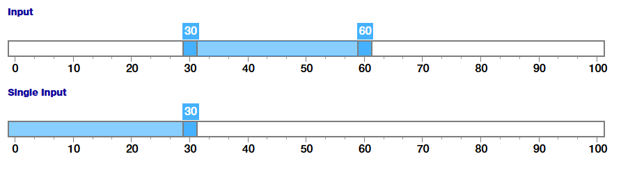

#### Action Button

`sszActionButton()` provides a styled version of `actionButton()` from Shiny.

``` r
sszActionButton("ActionButtonId", "Abfrage starten")
```

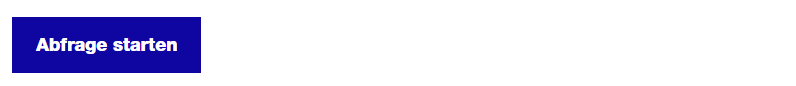

#### Download Buttons

`sszDownloadButton()` provides a styled download button based on `downloadButton()` from Shiny.

``` r
sszDownloadButton("csvDownload",
      label = "CSV",
      image = icons_ssz("download")
    )

sszDownloadButton("excelDownload",
      label = "XLSX",
      image = icons_ssz("download")
    )

sszDownloadButton("downloadDownload",
      image = icons_ssz("download")
    )

sszOgdDownload("ogdDownload",
      href = "https://data.stadt-zuerich.ch/"
    )
```

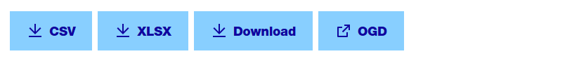

The `label` argument specifies the text displayed on the button. It must be one of `"Download"`, `"CSV"`, or `"XLSX"`. The default value is `"Download"`.

The `image` argument allows an icon or image to be displayed before the button text. It should be supplied as an HTML `<i>` or `` tag. The default is `NULL`, meaning no icon is shown. A button linking to an external resource can be createt using `sszOgdDownload()`. Provide the appropriate link in the `href` parameter

#### Button Layout Helper

When you want several buttons displayed next to each other, wrap them in a container with the `button-div` CSS class. It applies a horizontal flex layout with space between items on wide screens and switches to a stacked column layout on small screens (see the responsive rules for `.button-div` and `.downloadWrapperDiv`).

Example:

``` r
div(
  class = "button-div",
  sszDownloadButton("csvDownload", label = "CSV"),
  div(class = "downloadWrapperDiv", sszDownloadButton("excelDownload", label = "XLSX"))
)
```

#### Date Range

`sszDateRange()` provides a styled version of `dateRangeInput()` from Shiny. By default, the language is German and the date format is `dd.mm.yyyy`. This and additional parameters to Shiny's `dateRangeInput` can be passed as parameters.

``` r
sszDateRange("DateRange", "Datum",
    start = "2001-01-01",
    end = "2010-12-31",
    min = "2001-01-01",
    max = "2012-12-21",
    separator = icons_ssz("calendar"),
    weekstart = 1
  )
```

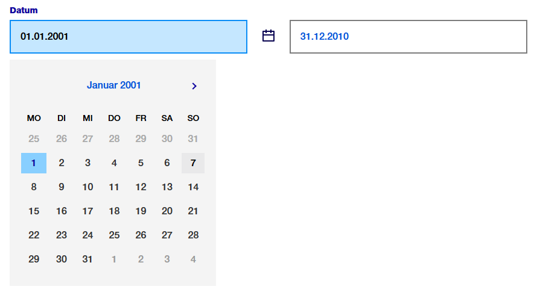

#### Date Selection with Air Datepicker

`sszAirDatepickerInput()` provides a styled wrapper around `airDatepickerInput()` from [`shinyWidgets`](https://dreamrs.github.io/shinyWidgets/). Unlike `dateRangeInput()`, it allows selecting years only or years and months, in addition to full dates. By default, the language is German and the date format is `dd.mm.yyyy`.

You can optionally supply a custom calendar icon using an HTML image tag with `htmltools::tags$img(...)`.

``` r
sszAirDatepickerInput(
          inputId = "airMonthStart2",
          label = "Basis Datum",
          dateFormat = "MM-yyyy",
          view = "years",
          minView = "months",
          autoClose = TRUE,
          ssz_icon = img(icons_ssz("calendar"))
        )
```

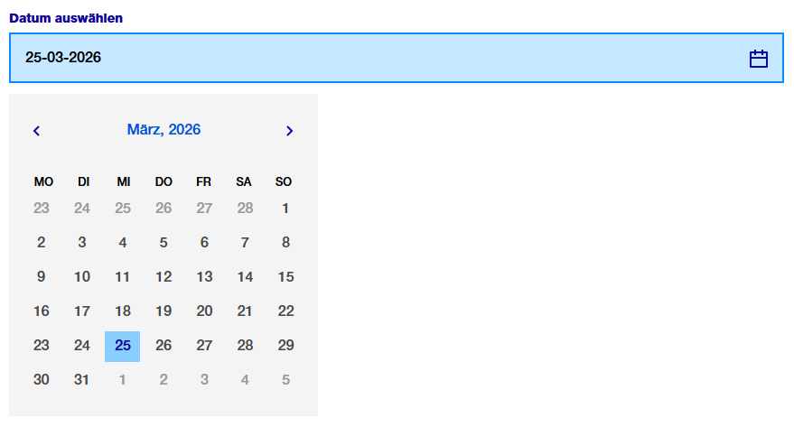

### Other Styling Options

#### bslib cards

Cards from [bslib](https://rstudio.github.io/bslib/articles/cards/index.html) can be used both in Shiny applications and in other HTML outputs. The CSS included in `zuericssstyle` (both the general CSS and the Shiny-specific CSS, see below) provides styling for these card components.

When creating cards, we recommend using a heading element inside `card_header` to ensure consistent typography and spacing.

``` r
library(bslib) card(   card_header(h5("A random header")),   card_body(     markdown("Some text with a [link](https://www.stadt-zuerich.ch/de/politik-und-verwaltung/statistik-und-daten.html)")   ),   card_footer("a footer") )
```

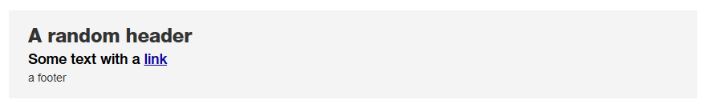

#### Tables

`zuericssstyle` provides CSS classes to style `reactable` tables in a way that is consistent with the corporate design. The styling includes borderless, minimal design with subtle striped background for readability.

``` r
reactable(iris,
    paginationType = "simple",
    class = "table-striped"
    language = reactableLang(
      noData = "Keine Einträge gefunden",
      pageNumbers = "{page} von {pages}",
      pagePrevious = "\u276e",
      pageNext = "\u276f"
    )
  )
```

A pair of CSS helper classes are provided for `reactable` usage:

-   `table-striped` — applies a subtle stripe to even rows and disables hover highlighting (use when you want persistent row striping).
-   `table-hover` — no persistent stripes; rows highlight on hover (use when you prefer interactive hover feedback).

When setting one of those classes, the `highlight` and `striped` arguments in reactable no longer influence the appearance of the table.

Example:

``` r
reactable(iris, class = "ssz-striped")
reactable(iris, class = "ssz-hover")
```


#### Context Box

`sszContextBox()` provides a styled box for additional contextual information, such as definitions, explanations, or glossary entries. It is intended to give users background or context information without indicating a warning (see `sszWarningBox()`).

The layout uses a flexible container to align the icon and text, and applies package-specific CSS classes to ensure consistent styling.

The `icon` argument allows an icon or image to be displayed before the text. The default is `NULL`, meaning no icon is shown.

``` r
 sszContextBox(
    title = "Information mit Icon",
    text = "Laboris laborum aute id laboris culpa esse aliquip nisi anim velit. Minim sunt eiusmod do laborum amet ut magna. Labore dolore id nostrud enim Lorem pariatur ad dolore id eiusmod adipisicing laboris laborum minim.",
    icon = icons_ssz("info-help-filled")
  )

  sszContextBox(
    title = "Informationen ohne Icon",
    text = "Laboris laborum aute id laboris culpa esse aliquip nisi anim velit. Minim sunt eiusmod do laborum amet ut magna. Labore dolore id nostrud enim Lorem pariatur ad dolore id eiusmod adipisicing laboris laborum minim."
  )
```


#### Info and Warning Box

`sszInfoBox()` provides a styled box for query-related informational messages, such as summaries or explanations about the current results. It is meant to convey neutral information regarding the query itself, rather than warnings or general context.

`sszWarningBox()` provides a styled warning box to alert users to potential issues, errors, or important considerations regarding the query or its results.

The layout uses a flexible container to align the icon and text, and applies package-specific CSS classes to ensure consistent styling. `sszInfoBox()` and `sszWarningBox()` use both the same CSS classes.

The `icon` argument allows an icon or image to be displayed before the text. The default is `NULL`, meaning no icon is shown.

``` r
sszInfoBox(
    title = "A message with the wrong sender will not be answered and will be deleted.",
    text = "Laboris laborum aute id laboris culpa esse aliquip nisi anim velit. Minim sunt eiusmod do laborum amet ut magna. Labore dolore id nostrud enim Lorem pariatur ad dolore id eiusmod adipisicing laboris laborum minim.",
    icon = icons_ssz("info-help-filled")
  )

sszWarningBox(
    title = "Title Error",
    text = "Laboris laborum aute id laboris culpa esse aliquip nisi anim velit. Minim sunt eiusmod do laborum amet ut magna. Labore dolore id nostrud enim Lorem pariatur ad dolore id eiusmod adipisicing laboris laborum minim.",
    icon = icons_ssz("important-warning-filled")
  )
```


#### Text

Normal paragraph text uses the proprietary display font (`HelveticaNeueLTPro`) and is sized at `18px`. You can override this locally, but the package defaults provide consistent, readable body text across pages and apps. There is two text-specific utility classes in `zuericssstyle`

-   `.bold-text`: apply this class to inline elements (links, spans, strong) to render them with the package's title/font family.

-   `.dashed-list`: a special list variant that removes the native marker and padding (useful for compact dashed-style lists). The package also provides counter-based `ol` and custom `ul` markers so markers align consistently across breakpoints.

``` r
p("This text will be ",
   strong(class = "bold-text", "bold"),
   "."
  )

tags$ul(class = "dashed-list",
  tags$li("First item"),
  tags$li("Second item")
)
```

#### Div for Chart Buttons

The `.ssz-chart-buttons` CSS class can be applied to a `<div>` to create a flexible layout with centered content and a buttom margin, suitable for grouping chart-related buttons.

Example usage:

``` r
div(
  class = "ssz-chart-buttons",
  sszRadioGroupButtons(
    inputId = "choice_year",
    choices = c(2022, 2023, 2024)
    )
  )
```

#### Tooltip

`zuericssstyle` also provides CSS classes for tooltip styling (.`tooltip-container`, .`tooltip-title`, .`tooltip-content`, .`tooltip-row`). For an example, see `inst/examples/tooltip/app.R`. This example demonstrates how to use the CSS classes only; it does not provide graphs fully styled according to the corporate design of the City uf Zurich. For fully styled charts, refer to the [`zueriplots`](https://github.com/StatistikStadtZuerich/zueriplots) documentation.

### CSS File for HTML

If you need the CSS file to style an HTML report or other HTML outputs, use:

``` r
get_generic_css()
```

This will write the needed CSS file to your local folder. You can also specify a full file path (e.g. `"C:/temp/mystyling.css"`) as a parameter.

## Getting Help

If you encounter a bug, please open an issue or contact [statistik\@zuerich.ch](mailto:statistik@zuerich.ch).
