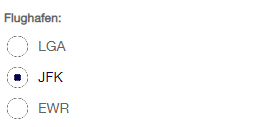
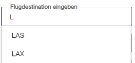
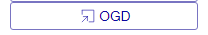

<!-- badges: start -->
[](https://CRAN.R-project.org/package=zuericssstyle)
[](https://github.com/StatistikStadtZuerich/zuericssstyle/actions/workflows/R-CMD-check.yaml)
[](https://cmp-sdlc.stzh.ch/OE-7035/ssz-da/libraries/zueriverse/zuericssstyle/badges/main/pipeline.svg?key_text=GitLabPipeline&key_width=100)
<!-- badges: end -->

# zuericssstyle 

zuericssstyle is an R-Package, which provides specific css files and styled shiny widgets according to the corporate design of the city of Zurich. The package contains widgets and styling that [Statistik Stadt Zürich](https://www.stadt-zuerich.ch/prd/de/index/statistik.html) have used so far for creating shiny apps that conform to the corporate design.

## Installation

The easiest way to get zuericssstyle is to install it from this repo:

``` r
# install.packages("devtools")
devtools::install_github("StatistikStadtZuerich/zuericssstyle")
```

Alternatively, download the files (by clicking 'Clone or download' / 'Download Zip'), extract it to any location on your computer, e.g. to your Desktop and then run:

``` r
remotes::install_local("<path_to_location>/zuericssstyle-main")
```

## Version

To check your version of zuericssstyle, run:

``` r
packageVersion("zuericssstyle")
```

## Usage

A number of functions wrap around the original shiny functions to provide styling. All functions allow additional parameters of the original shiny function to be used and passed along.

### bslib cards

[bslib cards](https://rstudio.github.io/bslib/articles/cards) can be used in a shiny app but also in other html outputs. Both the "general" css (see below) as well as the shiny css contain the css properties for the bslib cards.

We recommend using a heading in the `card_header` like this:

``` r
library(bslib)
card(
  card_header(h5("A header")),
  card_body(
    markdown("Some text with a [link](https://www.stadt-zuerich.ch/de/politik-und-verwaltung/statistik-und-daten.html)")
  ),
  card_footer("a footer")
)
```


### Styled shiny widgets

All widgets need the css to work. This is added as an html dependency when using the `ssz_page` or the `add_zcss_deps` functions. Use `ssz_page` as a styled drop-in replacement of shiny's `fluidPage`:

``` r
ui <- ssz_page(...)
```

Alternatively, if you are not using a fluid page, wrap your ui (e.g. `fixedPage` or whatever you fancy) in `add_zcss_deps`:

``` r
ui <- add_zcss_deps(fixedPage(...))
```

#### Numeric input


``` r
sszNumericInput("number", "Zahl", 4)
```

This is based on shiny's `numericInput`.

#### Select input


``` r
sszSelectInput("select", "Destination:", choices = c("HOU", "LAX", "JFK", "SEA"), selected = "LAX")
```

The function wraps around shiny's `selectInput`.

#### Radio buttons



``` r
sszRadioButtons(
   inputId = "ButtonGroupLabel",
   label = "Flughafen:",
   choices = c("EWR", "JFK", "LGA"),
   selected = "JFK"
   )
```

The function wraps around shiny's `radioButtons`. Use `inline = TRUE` for horizontal alignment.

#### Radio Group Buttons

{width="266"}

``` r
sszRadioGroupButtons(
    inputId = "years",
    choices = 2022:2024,
    selected = 2022 # default value
  )
```

The function wraps around `shinyWidgets::radioGroupButtons`.

#### Text input


``` r
sszTextInput("suchfeld", "Name:")
```

The function wraps around shiny's `textInput`.

#### Autocomplete



``` r
sszAutocompleteInput(
            "street",
            "Geben Sie eine Strasse ein",
            unique(addresses$StrasseLang)
          )
```

This relies on the `autocomplete_input()` function from the [dqshiny](https://github.com/daqana/dqshiny) package.

#### Slider input (Styling could change)


``` r
sszSliderInput(inputId = "choose_number", label = "sliderInput:", value = 30, min = 0, max = 100)
```

The function wraps around shiny's `sliderInput`. Currently this is not officially part of the city's CI/CD. Therefore the styling for the sliderInput might vary slightly at a later point in time (as of 2024-10-16).

#### Action button


``` r
sszActionButton("ActionButtonId", "Abfrage starten")
```

The function wraps around shiny's `actionButton`.

#### Download buttons


A download button for downloading an excel/csv file can be called with

``` r
sszDownloadButton("csvDownload",
                        label = "csv",
                        image = img(icons_ssz("download"))
                        )
```

The image parameter is optional; it is based on shiny's `downloadButton`.

A button for a link to an external site, e.g. an Open Government Data portal,  can be used with

``` r
sszOgdDownload(outputId = "ogdDown",
                         label = "OGD",
                         href = "https://data.stadt-zuerich.ch/",
                         image = img(icons_ssz("external-link"))
            )
```

Provide the appropriate link in the `href` parameter.

#### Date Range


``` r
sszDateRange("DateRange", "Datum:",
   start  = "2001-01-01",
   end    = "2010-12-31",
   min    = "2001-01-01",
   max    = "2012-12-21"
   )
```

By default, the language is German and the date format is `dd.mm.yyyy`. This and additional parameters to shiny's `dateRangeInput` can be passed as parameters.

#### Date selection with shinyWidgets::airDatepickerInput

In contrast to the standard `dateRangeInput`, the `airDatepickerInput` allows selection of only years, or years and months, rather than 'only' year-month-day as with the `dateRangeInput`

By default, the language is set to `'de'`, and the `dateFormat` to `"dd.mm.yyyy"`. Both parameters can be overridden by supplying something else.

There are options for adding a specific calendar icon. It can be passed to be used instead of the default Shiny calendar icon in the form of a `htmltools::tags$img(...)`.


``` r
sszAirDatepickerInput(
          inputId = "airMonthStart2",
          label = "Basis Datum",
          dateFormat = "MM-yyyy",
          view = "years",
          minView = "months",
          autoClose = TRUE,
          ssz_icon = img(icons_ssz("calendar"))
        )
```

The version of `sszAirDatepickerInput()` with no calendar icon is not styled according to the corporate design of the city of Zurich.

### Other styling options

#### Div for chart buttons

We provide a class `ssz-chart-buttons` which can be used with a div to provide flex display, centered content and a bottom margin.

Example usage:
``` r
div(
      class = "ssz-chart-buttons",
      sszRadioGroupButtons(
        inputId = "choice_year",
        choices = c(2022, 2023, 2024)
      )
    )
```

#### Tooltip

We provide also classes for tooltip styling (`tooltip-container`, `tooltip-title`, `tooltip-content`, `tooltip-row`). For an example usage, please see `inst/examples/tooltip/app.R`, though note that this only demonstrates the usage of the CSS classes but does not provide a graph that is styled according to the styling guidelines of the city of Zurich. For the latter, please consult the zueriplots documentation.

### CSS file for html

If you need the css file to e.g. style a html report, use

``` r
get_generic_css()
```

to get the css file written to your local folder. Alternatively, you can provide a full filepath (something like "C:/temp/mystyling.css" as a parameter.)

## Getting help

If you encounter a bug, please open an issue or contact [statistik\@zuerich.ch](mailto:statistik@zuerich.ch).
