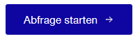

# zuericssstyle
zuericssstyle is an R-Package, which provides specific css files and styled shiny widgets according to the corporate design of the city of Zurich. The package contains widgets and styling that [Statistik Stadt Zürich](https://www.stadt-zuerich.ch/prd/de/index/statistik.html) have used so far for creating shiny apps that conform to the corporate design.

## Installation
The easiest way to get zuericssstyle is to install it from this repo:

```{r, eval = FALSE}
# install.packages("devtools")
devtools::install_github("StatistikStadtZuerich/zuericssstyle")
```

Alternatively, download the files (by clicking 'Clone or download' / 'Download Zip'), extract it to any location on your computer, e.g. to your Desktop and then run:

```{r, eval = FALSE}
remotes::install_local("<path_to_location>/zuericssstyle-main")
```

## Version
To check your version of zuericssstyle, run:

```{r, eval = FALSE}
packageVersion("zuericssstyle")
```

## Usage

A number of functions wrap around the original shiny functions to provide styling. All functions allow additional parameters of the original shiny function to be used and passed along.

### Styled shiny widgets

All widgets need the css to work. Get this written to your local folder with

```{r, eval = FALSE}
get_shiny_css()
```
Alternatively, you can provide a full filepath (something like "C:/temp/mystyling.css") as a parameter.

#### Download buttons


A download button for downloading an excel/csv file can be called with 
```{r, eval = FALSE}
sszDownload("csvDownload", label = "csv")
```
This is the only function not based on a shiny function.

A button for a link to an external site, e.g. an Open Government Data portal, 

can be used with 
```{r, eval = FALSE}
sszOgdDownload(
   inputId = "ogdDown", 
   label = "OGD",
   onclick = "window.open('https://data.stadt-zuerich.ch/', '_blank')"
)
```
Provide the appropriate link in the `onclick` parameter. The function wraps around shiny's `actionButton`.

#### Select input


```{r, eval = FALSE}
sszSelectInput("select", "Destination:", choices = c("HOU", "LAX", "JFK", "SEA"), selected = "LAX")
```
The function wraps around shiny's `selectInput`.

#### Text input


```{r, eval = FALSE}
sszTextInput("suchfeld", "Name:")
```
The function wraps around shiny's `textInput`.

#### Radio buttons


```{r, eval = FALSE}
sszRadioButtons(
   inputId = "ButtonGroupLabel",
   label = "Flughafen:",
   choices = c("EWR", "JFK", "LGA"),
   selected = "JFK"
   )
```
The function wraps around shiny's `radioButtons`. Use `inline = TRUE` for horizontal alignment.

#### Date Range


```{r, eval = FALSE}
sszDateRange("DateRange", "Datum:",
   start  = "2001-01-01",
   end    = "2010-12-31",
   min    = "2001-01-01",
   max    = "2012-12-21"
   )
``` 
By default, the language is German and the date format is `dd.mm.yyyy`. This and additional parameters to shiny's `dateRangeInput`  can be passed as parameters. 

#### Date selection with shinyWidgets::airDatepickerInput

In contrast to the standard `dateRangeInput`, the `airDatepickerInput` allows selection of only years, or years and months, rather than 'only' year-month-day as with the `dateRangeInput`

By default, the language is set to `'de'`, and the `dateFormat` to `"dd.mm.yyyy"`. Both parameters can be overridden by supplying something else.

Additionally, there are options for adding a specific calendar icon. By default, it looks like this, no calendar icon is shown, and internally, `addon` is set to `'none'`.


```{r, eval = FALSE}
sszAirDatepickerInput(
          inputId = "airMonthStart",
          label = "Basis Datum",
          dateFormat = "MM-yyyy",
          view="years",
          minView="months",
          autoClose=TRUE
        )
``` 


Alternatively, a custom image can be passed to be used instead of the calendar icon, in the form of a `htmltools::tags$img(...)`.


```{r, eval = FALSE}
sszAirDatepickerInput(
          inputId = "airMonthStart2",
          label = "Basis Datum",
          dateFormat = "MM-yyyy",
          view = "years",
          minView = "months",
          autoClose = TRUE,
          ssz_icon = img(icons_ssz("calendar"))
        )
```

#### Action button


```{r, eval = FALSE}
sszActionButton("ActionButtonId", "Abfrage starten")
```
The function wraps around shiny's `actionButton`.

A separate function exists if an icon/image is to be added to the button (as a `htmltools::tags$img(...)`)



```{r, eval = FALSE}
sszActionButtonIcon("ActionButtonId",
                       "Abfrage starten",
                       ssz_icon = img(icons_ssz$`arrow-right`)
                       )
```

#### Autocomplete

```{r, eval = FALSE}
sszAutocompleteInput(
            "street",
            "Geben Sie eine Strasse ein",
            unique(addresses$StrasseLang)
          )
``` 
This relies on the `autocomplete_input()` function from the [dqshiny](https://github.com/daqana/dqshiny) package.

### CSS file for html
If you need the css file to e.g. style a html report, use 

```{r, eval = FALSE}
get_generic_css()
```

to get the css file written to your local folder. Alternatively, you can provide a full filepath (something like "C:/temp/mystyling.css" as a parameter.)

## Getting help

If you encounter a bug, please contact statistik@zuerich.ch.
